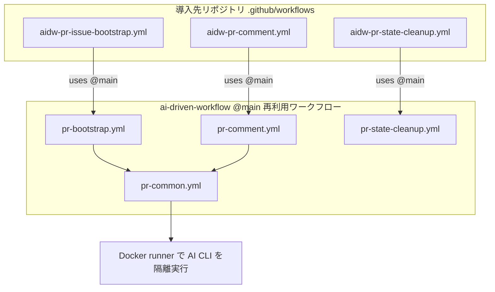

# ai-driven-workflow

GitHub の issue / PR コメントをきっかけに、AI（Codex / Cursor CLI）が PR 上で自律的に開発を進める仕組みを、**どのリポジトリにも導入できる形**で提供するツールリポジトリです。人間は issue を立て、PR にコメントして方針の舵取りをするだけで、実装は AI が進めます。

もともと特定リポジトリ専用だった仕組みを汎用化し、GitHub Actions の **再利用ワークフロー（reusable workflow）** として配布します。導入先には数枚の薄いトリガ workflow を置くだけで動きます。

## できること

- `AI主導開発` ラベルを付けた issue を起票（またはラベル付与）すると、対応用の PR が自動で作られる。
- その PR に（書き込み権限のあるユーザーが）コメントすると、AI が起動して PR 上で作業し、結果を PR コメント / PR 本文に反映する。
- 会話の状態は PR 単位で暗号化保存され、次回以降の実行に引き継がれる。PR が close されると破棄される。
- 使用する AI CLI（Codex / Cursor CLI）をラベルまたはリポジトリ Variable で切り替えられる。

## 仕組み（アーキテクチャ）

導入先リポジトリの `.github/workflows/` に置く薄いトリガ workflow が、本リポジトリの再利用ワークフローを `uses: <owner>/ai-driven-workflow/.github/workflows/*.yml@main` で呼び出します。再利用ワークフローは、自身（このツールリポジトリ）を `job.workflow_repository` / `job.workflow_sha` で再帰的に checkout してスクリプト・Docker 定義・スキルを取得し、導入先のコードを作業ツリーとして AI を実行します。



- **`@main` 参照のため、導入先は更新作業なしで常に最新を追従**します。ツールリポジトリ側でのバージョン管理（タグ付け等）は不要です。安定運用したい場合のみ、導入先で `@v1` や `@<SHA>` に固定できます。
- AI に渡すスキルは入れ子 submodule [`external/skills`](https://github.com/tetetratra/skills)（`tetetratra/skills`）を参照します。
- 命名規則：本体（再利用ワークフロー）は `pr-*.yml`、導入先に置く薄いトリガは `aidw-*.yml`（`aidw` = ai-driven-workflow）。トリガにプレフィックスを付けることで、導入先から「外部の仕組みを使っている」と一目で分かり、本体ワークフローとの同名衝突も避けられます（このリポジトリ自身に導入する場合も衝突しません）。

## 前提

- 本リポジトリ（`ai-driven-workflow`）は **public** で公開してください（public な再利用ワークフローは任意のリポジトリから呼び出せます）。
- 導入先で AI 実行に使う CLI の認証情報（Secret）が必要です。

## 導入手順

導入先リポジトリのルートで、以下のコマンドをそのまま実行してください。専用スクリプトの取得は不要で、3 つのトリガ workflow をその場で生成します。

### 1. トリガ workflow を設置する

先頭の `AIDW_REPO` / `AIDW_REF` だけ必要に応じて書き換えて、ブロック全体を実行します（`AIDW_REF` は `main` で常に最新追従、固定したい場合はタグや SHA を指定）。

```sh
# 参照先（必要に応じて変更）
AIDW_REPO="tetetratra/ai-driven-workflow"
AIDW_REF="main"

mkdir -p .github/workflows

cat > .github/workflows/aidw-pr-issue-bootstrap.yml <<EOF
name: AI PR Issue Bootstrap

on:
  issues:
    types:
      - opened
      - labeled

permissions:
  actions: write
  contents: write
  issues: write
  models: read
  pull-requests: write

jobs:
  bootstrap:
    if: >-
      github.event.issue.state == 'open' && (
        (
          github.event.action == 'opened' &&
          contains(github.event.issue.labels.*.name, 'AI主導開発')
        ) || (
          github.event.action == 'labeled' &&
          github.event.label.name == 'AI主導開発'
        )
      )
    uses: ${AIDW_REPO}/.github/workflows/pr-bootstrap.yml@${AIDW_REF}
    secrets: inherit
EOF

cat > .github/workflows/aidw-pr-comment.yml <<EOF
name: AI PR Comment

on:
  issue_comment:
    types:
      - created

permissions:
  actions: write
  contents: write
  issues: write
  pull-requests: write

jobs:
  comment:
    uses: ${AIDW_REPO}/.github/workflows/pr-comment.yml@${AIDW_REF}
    secrets: inherit
EOF

cat > .github/workflows/aidw-pr-state-cleanup.yml <<EOF
name: AI PR State Cleanup

on:
  pull_request:
    types:
      - closed

permissions:
  actions: write
  contents: read

jobs:
  cleanup:
    uses: ${AIDW_REPO}/.github/workflows/pr-state-cleanup.yml@${AIDW_REF}
EOF
```

> トリガ workflow には `${{ ... }}` を含めていない（`if:` はベア式）ため、クォートなしヒアドキュメントの変数展開で参照先を埋め込めます。

### 2. ラベルを作成する

```sh
gh label create "AI主導開発" --color BFD4F2 --description "AI 主導で扱う issue/PR ラベル"
# 任意（AI CLI をラベルで切り替えたい場合）
gh label create "AI:codex" --color 0E8A16 --description "AI CLI に Codex を使う"
gh label create "AI:cursor-cli" --color 5319E7 --description "AI CLI に Cursor CLI を使う"
```

### 3. Secret / Variable を設定する

利用する CLI に応じて Secret を設定します。

```sh
# Codex を使う場合（trusted machine で codex login 済みであること）
base64 < "${CODEX_HOME:-$HOME/.codex}/auth.json" | tr -d '\n' | gh secret set CODEX_AUTH_JSON_B64

# Cursor CLI を使う場合
gh secret set CURSOR_API_KEY --body "<your-cursor-api-key>"

# 状態の暗号化（推奨。未設定だと状態は平文で Artifact 保存される）
gh secret set STATE_ENCRYPTION_PASSPHRASE --body "<任意の強固なパスフレーズ>"
```

既定の AI CLI を切り替える場合（ラベル未指定時のデフォルト。既定は `codex`）:

```sh
gh variable set AI_CLI_TOOL --body "cursor-cli"   # codex に戻すなら "codex"
```

### 4. Actions が PR を作成できるよう設定する

bootstrap は GitHub Actions の `GITHUB_TOKEN` で PR を作成します。リポジトリ設定で「Allow GitHub Actions to create and approve pull requests」が無効だと、`GitHub Actions is not permitted to create or approve pull requests` で失敗します。以下で有効化してください（Settings → Actions → General → Workflow permissions のチェックと同じ）。

```sh
gh api -X PUT "repos/$(gh repo view --json nameWithOwner --jq .nameWithOwner)/actions/permissions/workflow" \
  -f default_workflow_permissions=read \
  -F can_approve_pull_request_reviews=true
```

### 5. commit & push する

```sh
git add .github/workflows && git commit -m "chore: AI主導開発ワークフローを導入" && git push
```

## 使い方

1. `AI主導開発` ラベルを付けて issue を起票する（既存 issue にラベルを付けてもよい）。
2. 自動で対応用 PR が作られ、issue の依頼文が PR コメントに転記される。
3. PR にコメントして方針を指示する。コメントごとに AI が起動して作業する。
4. PR をマージ（または close）すると、保存していた状態 Artifact は破棄される。

> AI 実行はリポジトリへの書き込み権限（write 以上）を持つユーザーのコメントのみが起動できます。

## AI CLI の切り替え

| AI CLI | ラベル | `AI_CLI_TOOL` の値 |
|---|---|---|
| Codex（デフォルト） | `AI:codex` | `codex` |
| Cursor CLI | `AI:cursor-cli` | `cursor-cli` |

優先順位は「PR/issue のラベル」→「`AI_CLI_TOOL` Variable」です。両方のラベルが付いている場合は `AI:cursor-cli` を優先します。

## カスタマイズ（プロジェクト固有の依存）

実行用の Docker イメージは汎用最小構成（git / gh / jq / ripgrep / Node + Codex CLI / Cursor CLI など）です。プロジェクト固有のビルド/テスト依存が必要な場合は、トリガ workflow から呼ぶ際に再利用ワークフロー `pr-common.yml` の入力を渡して拡張できます。

- `setup_script`: AI 実行前にコンテナ内で走らせる導入先内のスクリプトパス（依存インストール等）。
- `runner_dockerfile`: 導入先リポジトリ内の独自 Dockerfile パス（既定のイメージを置き換える）。

これらを使う場合は、トリガ workflow の `bootstrap` / `comment` を `pr-bootstrap.yml` / `pr-comment.yml` 経由ではなく、`pr-common.yml` を直接呼ぶ形に調整し、必要な入力を `with:` で渡してください。

## リポジトリ構成

```
.github/workflows/      再利用ワークフロー（pr-bootstrap / pr-comment / pr-common / pr-state-cleanup）と自リポジトリ用 lint
scripts/                中核ロジック（PR 作成・コンテキスト解決・プロンプト生成・AI 実行・状態管理）
docker/runner.Dockerfile 汎用 AI runner イメージ
prompts/                branch slug 生成プロンプト
external/skills/         AI に渡すスキル（submodule: tetetratra/skills）
```

導入先に置くトリガ workflow は、上記「導入手順」のコードブロックで生成します（雛形ファイルやインストールスクリプトは同梱していません）。

## セキュリティ

- API キー・トークン・パスフレーズは、ファイル（状態 Artifact を含む）や PR / ログに永続化されません。
- 状態 Artifact は `STATE_ENCRYPTION_PASSPHRASE` 設定時に GPG(AES256) で暗号化されます。
- AI 実行は write 権限以上のユーザーのコメントに限定されます。

## 開発

```sh
# 静的検証（ローカル）
shellcheck $(find scripts -name '*.sh')
actionlint -ignore 'property "workflow_(repository|sha)" is not defined'
```

`main` への変更は全導入先へ即時伝播するため、後方互換を保つ運用を推奨します。

### skills サブモジュールの更新

AI に渡すスキルは `external/skills`（[tetetratra/skills](https://github.com/tetetratra/skills)）を submodule として参照しています。上流の更新を取り込むには、このリポジトリで以下を実行します。

```sh
# submodule を上流の最新コミットへ更新する
git submodule update --remote external/skills

# 参照コミットの更新をこのリポジトリにコミットする
git add external/skills
git commit -m "chore: skills サブモジュールを更新"
```

クローン直後など submodule が未取得の場合は、先に `git submodule update --init --recursive` を実行してください。

## ライセンス

[MIT](LICENSE)
